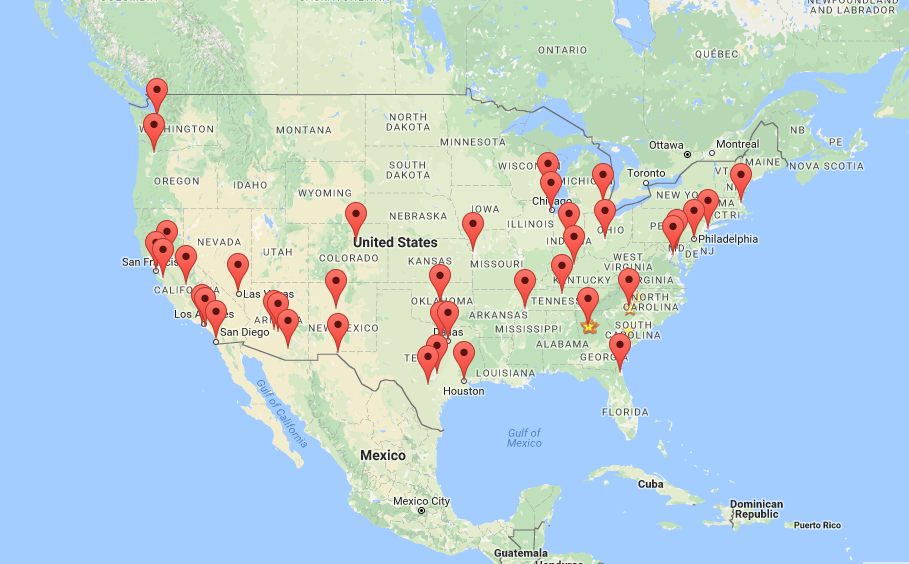

#Google Map App

###An application that uses the Google Maps API, AngularJS and SASS to create an experince that locates specified locations on the map.




##Installation

............

##Sample Code
```javascript
function City(yearRank,city,state,yearEstimate,lastCensus,change,landArea,landAreaInKm,lastPopDensity,lastPopDensityInKM,latLon){
    var latLonArr = [];
    this.yearRank = yearRank;
    this.city = city;
    this.state = state;
    this.yearEstimate = yearEstimate;
    this.lastCensus = lastCensus;
    this.change = change;
    this.landArea = landArea;
    this.lastPopDensity = lastPopDensity;
	latLonArray = latLon.split(",");    
    this.lat = Number(latLonArray[0]);
    this.lon = Number(latLonArray[1]);
    this.latLon = latLon;
}
```
##Features
	- 
	-
	-
	-


Visit my personal [Portfolio](http://shirletterly.com) for more information.